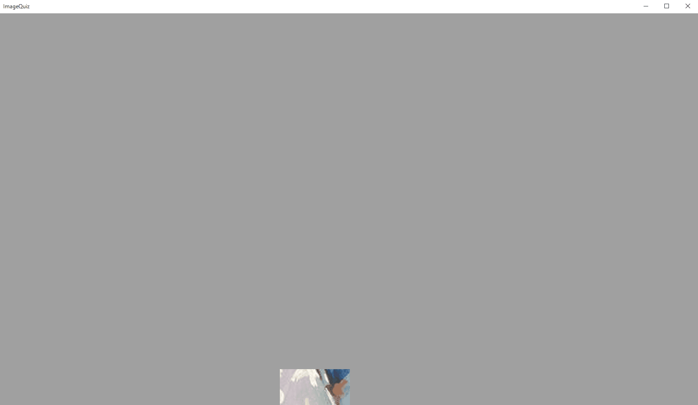

# ImageQuiz

Create an image quiz for your friends - who solves it first?

## Introduction

**ImageQuiz** is a small quiz application that shows images to the player(s) bit by bit. Starting fully covered the picture gets revealed gradually each second. 

How about movies? How about flowers? How about a sights? Create an image quiz for any of your favorite topics and let your friends contest!

## Getting Started

1. Download the [latest **ImageQuiz** release](https://github.com/selmaohneh/ImageQuiz/releases) or clone the repository and build the project yourself!
2. Create a folder that contains all images that belong to your quiz! Supported file types are *.jpg*, *.jpeg*, *.png*, and *.bmp*. **ImageQuiz** shows the images in alphabetical order. So if the order is important to your quiz, make sure to name the files accordingly (i.e. *a.jpg*, *b.png*, *c.bmp*)!
3. Start **ImageQuiz**!
4. Select the directory containing your images. If you already forgot: You created that folder in step 2. ;-)
5. Press *ENTER* to start playing! Press *ENTER* to show the solution! Press *ENTER* to show the next image. It is self-explaining - you just need your *ENTER* key.

## Contributing

* You created a cool quiz and want to share with others? Put the corresponding image folder inside the /Quizzes directory of this repository and [create a Pull Request](https://github.com/selmaohneh/ImageQuiz/pulls)!
* You found a bug or have an idea for a new feature? Please [file in issue](https://github.com/selmaohneh/ImageQuiz/issues).
* [Kaffee? :-)](https://www.buymeacoffee.com/SaMAsU1N6)
